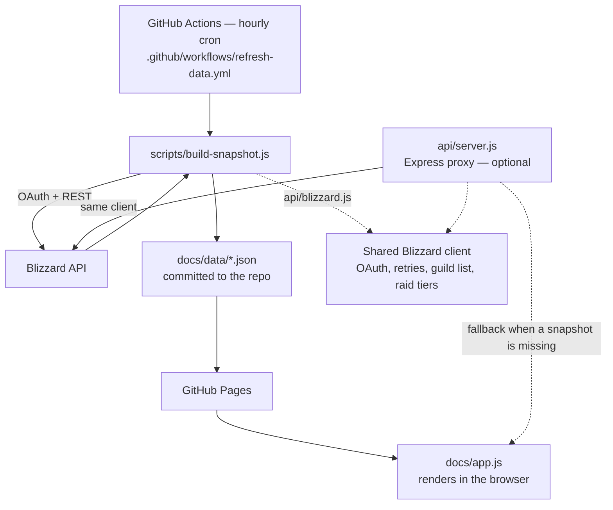

# Architecture

How the dashboard is put together, and why it's built this way.

## The short version

The public site is static files. Nothing runs at request time — no server, no API calls, no keys in the browser. A GitHub Action fetches everything from Blizzard once an hour, writes JSON into `docs/data/`, and commits it. GitHub Pages serves the result.

## Why snapshots instead of a live API

Blizzard's API needs an OAuth client secret, which can't live in a static site. The options were to run a server permanently, or to fetch on a schedule and commit the result.

Snapshots won because the data barely changes. Item level moves when someone raids; the roster moves when someone rolls an alt. Hourly is plenty. In exchange:

- The site has no runtime dependencies and no secret to leak. If Blizzard's API is down, the dashboard still loads — it just shows the last good snapshot with its age in the header.
- Page loads are a static file fetch, not a fan-out of 30+ upstream calls.
- The snapshots are diffable, so the repo doubles as a history of the guild.

The cost is that the repo grows: the hourly commits dominate the log. Sorting the collection keys (see below) removed most of the churn, but if it becomes a problem the snapshots can be moved to an orphan `data` branch.

## Components

| Path | Role |
|---|---|
| `docs/index.html` | Page shell. Static controls wire directly to functions; generated markup uses delegated `data-action` handlers. |
| `docs/app.js` | Everything else: fetching, filtering, rendering, URL state, all six views. No framework, no build step. |
| `docs/style.css` | Design tokens plus component styles. Class colours are passed in as CSS custom properties from JS. |
| `docs/data/*.json` | The committed snapshots. See [DATA.md](DATA.md). |
| `api/blizzard.js` | The only code that talks to Blizzard. OAuth, retries, response shaping, the guild list, and the raid tier definitions. |
| `api/server.js` | Optional Express proxy for local dev or a VPS. Serves `/api/*` and the `docs/` frontend. |
| `scripts/build-snapshot.js` | What the workflow runs. Walks every guild, writes the JSON files. |

`api/blizzard.js` is deliberately framework-free — no Express, no cache library — so both the server and the snapshot builder can import it and produce identical data shapes. When those two drifted apart previously, the raid tab silently served empty results.

## Data flow in the browser

1. `loadFromURL()` reads the query string. Every parameter is checked against an allow-list; anything unrecognised falls back to a default rather than reaching the DOM.
2. `loadGuild()` fetches `data/guild-{slug}.json`. Each request carries a token, so if you switch guilds twice quickly, a slow first response can't overwrite the second.
3. Members are annotated with their owner from `OWNER_MAP` and the level cap is derived from the data.
4. `filterAndRender()` applies scope → filters → sort, and renders cards.
5. Every state change calls `updateURL()`, so the address bar always describes what you're looking at.

Other tabs render lazily on first switch. Raid and collection data live in separate files and are only fetched when you open those tabs.

## Scope: active, archive, all

The dashboard only ever shows characters present in `OWNER_MAP` — it's a dashboard for a specific group of players, not a guild directory. Within that, characters are split by last login: **Active** is under 30 days, **Archive** is everything older, **All** is both. This is the single scope control; the readiness, leaderboard and raid tabs all respect it, so the tabs can't disagree about who's being counted.

## Caching and freshness

| Layer | TTL | Notes |
|---|---|---|
| Snapshot build | 1 hour | The cron schedule. `generated-at.json` records the time; the header shows its age. |
| Browser fetch of snapshots | `no-cache` | Always revalidated, so a refresh picks up a new snapshot immediately. |
| Express: character | 5 min | In-process `node-cache`. |
| Express: guild roster | 15 min | Roster fetches are the expensive ones. |
| Express: raid progress | 30 min | Changes slowest. |
| Express: HTTP responses | matches the above | `Cache-Control` mirrors each route's server-side TTL. |

## Failure containment

The pipeline's job is to never publish something worse than what it already has.

- **Per-character failures are tolerated.** `fetchCharacter` uses `Promise.allSettled` across five endpoints, so a character with a missing statistics endpoint still renders with the rest of its data.
- **Partial runs are rejected.** If a guild comes back empty, or loses more than 30% of its characters versus the snapshot on disk, the build throws and the workflow fails. Nothing is committed. The previous snapshot stays live and simply gets older, which the header shows.
- **Transient upstream errors are retried** with backoff, honouring `Retry-After` on 429. A 401 clears the cached OAuth token and retries once.
- **Writes are atomic** — temp file plus rename — so a killed run can't leave truncated JSON in `docs/data/`.
- **The frontend degrades rather than blanks.** A failed guild load clears the roster and shows a retry button; a missing collections file shows an explanation instead of an error string.

## Determinism

Collection files are keyed by character name and were previously written in whatever order the concurrent fetches finished. That rewrote roughly a megabyte of JSON every hour regardless of whether anything changed. Keys are sorted before writing, so an hour with no activity produces no diff.

## Things that are deliberately simple

- **No build step.** The frontend is three files you can open directly. This is the main reason the project is easy to pick back up after months away.
- **No framework.** Rendering is template literals and `innerHTML`. That puts the burden on escaping, so every interpolated value goes through `esc()` and generated markup never carries inline handlers.
- **No database.** Git is the store, JSON is the format.
