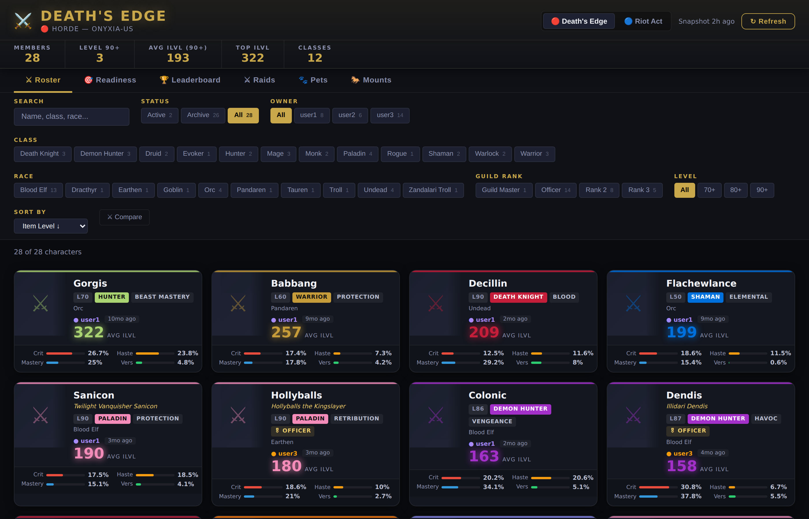
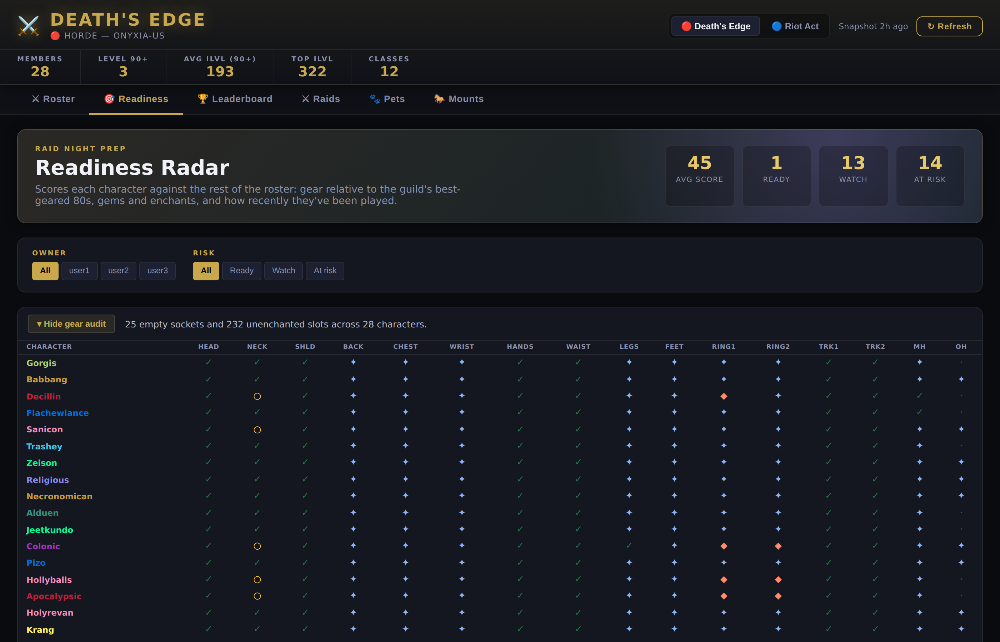
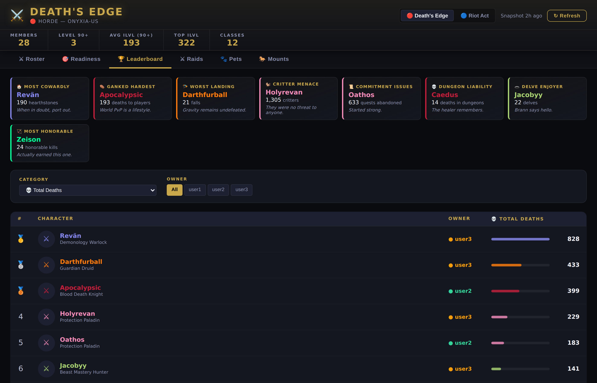
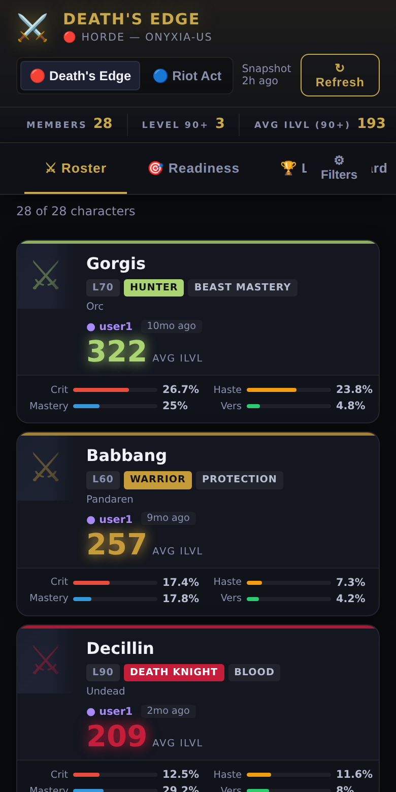
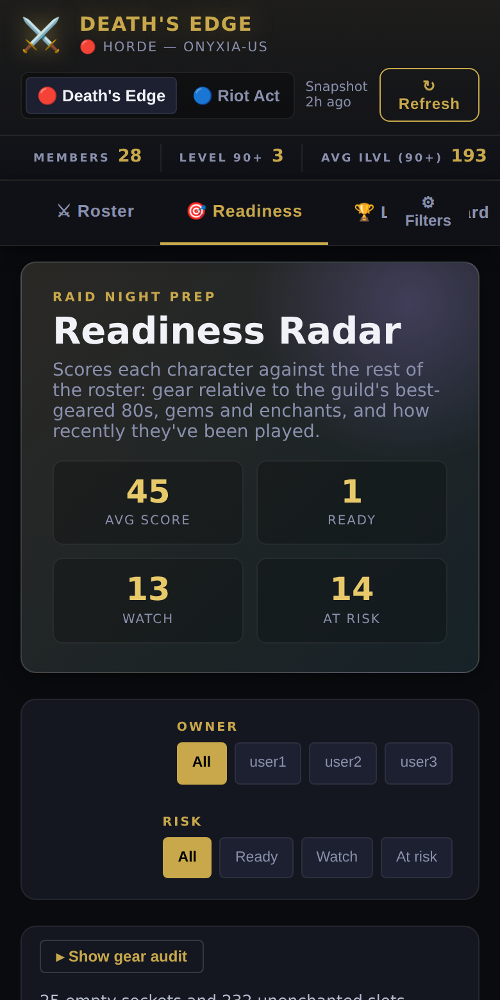

# ⚔️ Deaths Edge — WoW Guild Dashboard

Live dashboard for the Deaths Edge (Horde) and Riot Act (Alliance) guilds on Onyxia-US.

## Live Site
[https://millibus.github.io/wow-dashboard](https://millibus.github.io/wow-dashboard)



## Features

- 📊 **Roster** — every character with ilvl, class, spec, guild rank, last-seen and stat bars
- 🎯 **Readiness Radar** — scores each character on gear, gems/enchants and recent activity, relative to the rest of the guild, with a per-slot gear audit board
- 🏆 **Leaderboard** — rank on any stat, plus a Hall of Infamy built from the life stats nobody asks for
- ⚔️ **Raid progress** — per-boss kill grid by tier and difficulty
- 🐎 **Mounts** and 🐾 **Pets** — per character, with guild-wide rarity ("3 of 19 own this") and Wowhead links
- 🔬 Click any character for full gear, stats and where those stats come from
- ⚔️ Compare any two characters side by side
- 🔍 Filter by owner, class, race, rank, level or name — all filter state lives in the URL, so any view is shareable

### Readiness Radar

Scores are relative to your own roster, not to a fixed end-game item level, so the tab stays useful whether the guild is levelling or raiding. The gear audit board underneath shows which slots are missing gems and enchants.



### Leaderboard



### On a phone

Filters collapse behind a toggle that shows how many are active, and the tab strip stays pinned while you scroll.

<p align="center">
  
  
</p>

## Architecture

```
GitHub Actions (hourly cron)
        │
        ▼
scripts/build-snapshot.js  ──► Blizzard API (OAuth)
        │
        ▼
docs/data/*.json   ──►  GitHub Pages auto-deploy
        │
        ▼
docs/app.js  (reads JSON, no API at runtime)
```

- **Frontend** — Static HTML/CSS/JS in `docs/`, served via GitHub Pages.
- **Data** — JSON snapshots in `docs/data/` (`guild-{slug}.json`, `raid-{slug}.json`, `collections-{slug}.json`, `generated-at.json`), regenerated hourly by `.github/workflows/refresh-data.yml`. The frontend reads these files directly — no runtime API calls.
- **Live API (optional)** — `api/server.js` is a Node/Express proxy over the Blizzard API. Used for local development and as the runtime path when serving the dashboard from a VPS. Not required by the public Pages site.
- **Shared client** — `api/blizzard.js` exports the OAuth client, fetch helpers and the guild list. Imported by both `api/server.js` and `scripts/build-snapshot.js` so there's one source of truth.

More detail: [ARCHITECTURE.md](ARCHITECTURE.md) · [DATA.md](DATA.md) · [OPERATIONS.md](OPERATIONS.md)

## Setup

### Repo secrets (one-time, for the workflow)

The hourly workflow needs Blizzard OAuth credentials as repo secrets. Create an app at <https://develop.battle.net/access/clients> for the values, then:

```bash
gh secret set BLIZZARD_CLIENT_ID -R millibus/wow-dashboard
gh secret set BLIZZARD_CLIENT_SECRET -R millibus/wow-dashboard
```

### Local development

```bash
cd api
cp .env.example .env       # fill in BLIZZARD_CLIENT_ID / BLIZZARD_CLIENT_SECRET
npm install

# Option A — regenerate static snapshots and serve them locally
node ../scripts/build-snapshot.js
cd ../docs && python3 -m http.server 8000   # open http://localhost:8000

# Option B — run the live Express server (proxies Blizzard at request time)
npm start                  # serves /api/* AND the /docs frontend on port 3002
```

When running via Option B, set `API_BASE = ''` in `docs/app.js` (the default) — `fetchData` falls back to the live `/api/*` endpoints if a snapshot file is missing.

You can browse the dashboard with no credentials at all: the committed snapshots in `docs/data/` are all the frontend needs.

### VPS deployment (live API)

The Express server runs anywhere Node does. `ecosystem.config.js` resolves paths relative to itself, so the checkout can live wherever you like:

```bash
cd api
npm ci
cp .env.example .env       # Blizzard credentials
pm2 start ecosystem.config.js
```

Set `ALLOWED_ORIGINS` in `.env` to the origins that should be able to call the API (comma-separated). It defaults to the public site plus localhost — the proxy holds your Blizzard credentials, so don't open it up further than you need.

The VPS path is independent of the public GitHub Pages site — both can run simultaneously, and the frontend prefers snapshots when present.

### Manually trigger a refresh

```bash
gh workflow run refresh-data.yml -R millibus/wow-dashboard
gh run watch -R millibus/wow-dashboard
```

## Adding a guild

1. Add the slug to `GUILDS` in `api/blizzard.js` — the API server and the snapshot builder both read it from there.
2. Add a display title and subtitle to `GUILDS` in `docs/app.js`.
3. Add a toggle button in `docs/index.html` with the matching `data-slug`.

## Adding an owner mapping

Edit `OWNER_MAP` in `docs/app.js`. Owner labels are deliberately anonymised (`user1`/`user2`/`user3`) because the site is public.

## Maintenance

Raid tiers are a hardcoded list in `api/blizzard.js`. When a new raid opens you have to add it, or the Raids tab will keep showing the previous expansion — see [OPERATIONS.md](OPERATIONS.md#raid-tiers-go-stale-every-patch) for how to look up the IDs.
